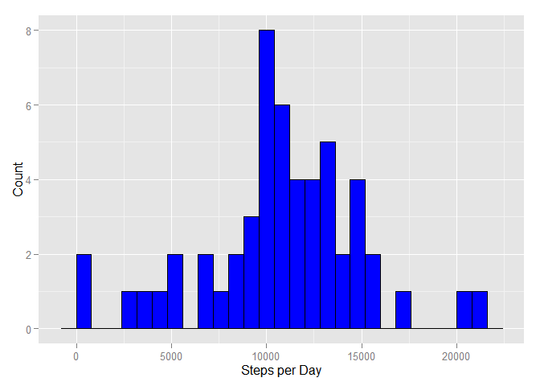
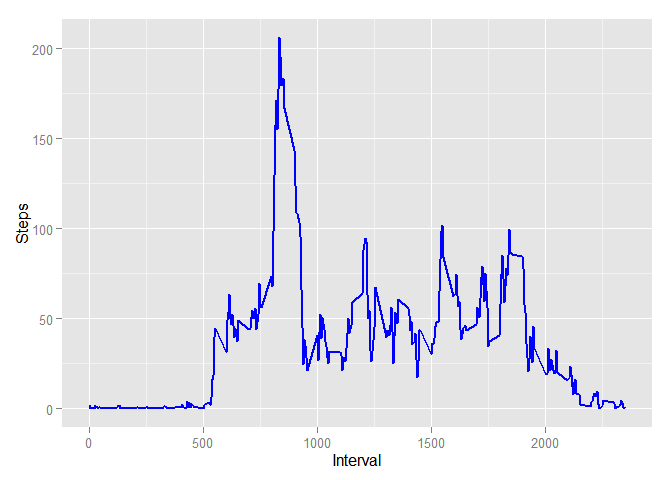
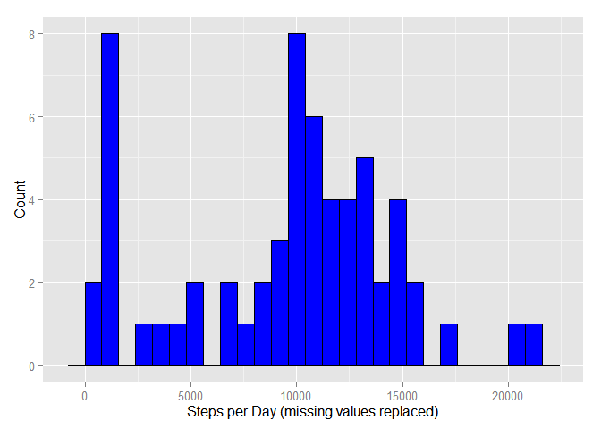
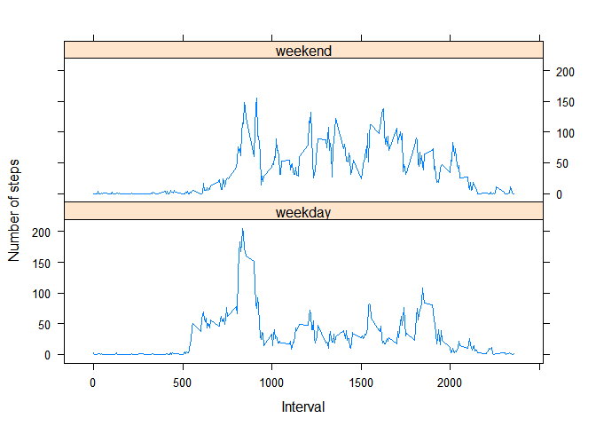

# PepData_PeerAssessment1
Yunzhuo  
Sunday, February 15, 2015  

### Load the dataset


```r
data= read.csv("activity.csv")
data$date<-as.Date(data$date)
```

### What is mean total number of steps taken per day?
1.plot the histogram

```r
histdata = with(data, aggregate(steps, by = list(date), sum))
names(histdata) = c("Date", "Steps")
library(ggplot2)
histgraph = ggplot(histdata, aes(x = Steps)) + 
      geom_histogram(binwidth=800,color="black", fill="blue") + 
      labs(x = "Steps per Day", y = "Count")
histgraph
```

 

2.get the mean and median value

```r
meansteps = mean(histdata$Steps, na.rm = T)
mediansteps = median(histdata$Steps, na.rm = T)
meansteps
```

```
## [1] 10766
```

```r
mediansteps
```

```
## [1] 10765
```

### What is the average daily activity pattern?
1.Make a time series plot (i.e. type = "l") of the 5-minute interval (x-axis) and the average number of steps taken, averaged across all days (y-axis)

```r
tseriesdata = with(data, aggregate(steps, by = list(interval), mean, na.rm = T))
names(tseriesdata) = c("Interval", "MeanSteps")
tseriesgraph = ggplot(tseriesdata, aes(x = Interval, y = MeanSteps)) + 
      geom_line(color = "blue", size = 1) +  
      labs(x = "Interval", y = "Steps")
tseriesgraph
```

 

2.Which 5-minute interval, on average across all the days in the dataset, contains the maximum number of steps?

```r
maxsteps = tseriesdata$Interval[which.max(tseriesdata$MeanSteps)]
maxsteps
```

```
## [1] 835
```

### Imputing missing values
1.Calculate and report the total number of missing values in the dataset (i.e. the total number of rows with NAs)

```r
sum(is.na(data$steps))
```

```
## [1] 2304
```
2.Devise a strategy for filling in all of the missing values in the dataset. The strategy does not need to be sophisticated.

My strategy is to use the mean for that 5-minute interval to fill the NA values.

3.Create a new dataset that is equal to the original dataset but with the missing data filled in

```r
fulldata = data
completedata = with(fulldata, aggregate(steps, by = list(interval), median, 
                                            na.rm = T))
names(completedata) = c("interval", "steps")

for (i in 1:nrow(fulldata)) {
      if (is.na(fulldata$steps[i]) == T) {
            fulldata$steps[i] = completedata$steps[data$interval[i] == 
                                                           completedata$interval]
      } else {          
      }
}
```

4.Make a histogram of the total number of steps taken each day and Calculate and report the mean and median total number of steps taken per day. Do these values differ from the estimates from the first part of the assignment? What is the impact of imputing missing data on the estimates of the total daily number of steps?

```r
histcompdata = with(fulldata, aggregate(steps, by = list(date), sum))
names(histcompdata) = c("Date", "Steps")
histcomplete = ggplot(histcompdata, aes(x = Steps)) + 
      geom_histogram(binwidth = 800, color="black", fill="blue")+ 
      labs(x = "Steps per Day (missing values replaced)", y = "Count")
histcomplete
```

 

```r
## Recalculate mean
meancompsteps = mean(histcompdata$Steps, na.rm=T)
meancompsteps
```

```
## [1] 9504
```

```r
## Compare to original mean value
meansteps
```

```
## [1] 10766
```

```r
## Recalculate median
mediancompsteps = median(histcompdata$Steps, na.rm=T)
mediancompsteps
```

```
## [1] 10395
```

```r
## Compare to original median value
mediansteps
```

```
## [1] 10765
```

#### Are there differences in activity patterns between weekdays and weekends?
1.Create a new factor variable in the dataset with two levels – “weekday” and “weekend” indicating whether a given date is a weekday or weekend day.

```r
fulldata$date = as.Date(fulldata$date)
dateweekdays = weekdays(fulldata$date)
dateweekend =  dateweekdays == "Sunday" | dateweekdays == "Saturday"
fulldata$day = factor(as.integer(dateweekend),
                            levels=c(0, 1),
                            labels=c("weekday", "weekend"))
head(fulldata)
```

```
##   steps       date interval     day
## 1     0 2012-10-01        0 weekday
## 2     0 2012-10-01        5 weekday
## 3     0 2012-10-01       10 weekday
## 4     0 2012-10-01       15 weekday
## 5     0 2012-10-01       20 weekday
## 6     0 2012-10-01       25 weekday
```

```r
table(fulldata$day)
```

```
## 
## weekday weekend 
##   12960    4608
```

2.Make a panel plot containing a time series plot (i.e. type = "l") of the 5-minute interval (x-axis) and the average number of steps taken, averaged across all weekday days or weekend days (y-axis). See the README file in the GitHub repository to see an example of what this plot should look like using simulated data.

```r
library('lattice')
weekdata = aggregate(steps ~ interval + day, FUN="mean", data = fulldata)
xyplot(steps ~ interval | day, data = weekdata,
         xlab = 'Interval', ylab = 'Number of steps',
         type = 'l', layout=c(1, 2))
```

 
